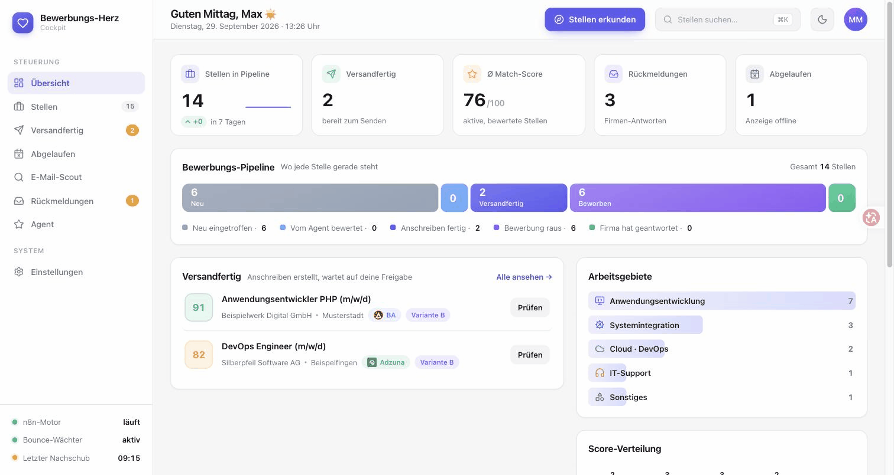

## Oktay Akyüz

**Ich baue Software, die ohne mich weiterläuft.** Und ich dokumentiere, warum sie es tut.

Fachinformatiker Anwendungsentwicklung (IHK) · AWS Certified Cloud Practitioner · Region Stuttgart

**Ich suche meinen Einstieg als Junior Software Developer** (C#/.NET, TypeScript), im Raum Stuttgart oder remote.

> **English:** Junior software developer with a German IHK qualification in application development and the AWS Certified Cloud Practitioner. I build and run a self-hosted automation platform (n8n, Next.js, PostgreSQL) that has been running unattended every day since June 2026. Open to junior developer roles in the Stuttgart area or remote.

---

### Die Automatisierungsplattform im Überblick

*Live-Demo mit erfundenen Daten: [job-application-cockpit-demo.vercel.app](https://job-application-cockpit-demo.vercel.app)*

---

### Projekte

| Projekt | Worum es geht |
|---|---|
| **Automatisierungsplattform** [Oberfläche](https://github.com/Oktay-94/job-application-cockpit) · [Backend](https://github.com/Oktay-94/n8n-job-automation) | Eine n8n-Datenpipeline holt Stellenanzeigen über zwei APIs, bewertet sie per LLM und führt jeden Zustand in PostgreSQL. Dazu eine Next.js-Oberfläche als installierbare PWA und Wächter-Workflows, die stille Ausfälle erkennen. Seit Juni 2026 jeden Tag unbeaufsichtigt im Betrieb. **[Live-Demo](https://job-application-cockpit-demo.vercel.app)** |
| **[CertOps](https://github.com/Oktay-94/certops)** | Lernplattform für AWS-Zertifizierungen: Karteikarten, Prüfungssimulation, Szenario-Karten mit Architekturdiagrammen. 53 Testdateien, CI mit Lint, Typecheck, Tests und Build. **[Live](https://certops-omega.vercel.app)** |
| **[Document Cockpit](https://github.com/Oktay-94/document-cockpit)** | Dokumentenverwaltung mit OCR, semantischer Suche über Embeddings (pgvector, RAG), Fristenerkennung und Chat über den eigenen Bestand |
| **IHK-Abschlussprojekt** | C#/.NET-8-Anwendung, die eine OPNsense-Firewall über ihre REST-API steuert: Internetzugang eines Schulungsraums per Klick sperren und zeitgesteuert freigeben. Bewertet mit „gut“ (84 Punkte). |

---

### Wie ich arbeite

**Messen statt erinnern.** Jede Zahl, ID und jeder Pfad trägt ein Etikett:
GEMESSEN, GEFOLGERT, ANNAHME oder NICHT MESSBAR. Ein Wert ohne Herkunft aus
der laufenden Sitzung wird nicht behauptet, sondern erhoben.

**Kein leeres Ergebnis ohne Positivkontrolle.** Eine Suche, die nichts findet,
kann auch falsch gesucht haben. Vor jedem „0 Treffer“ läuft dieselbe Suche
gegen einen bekannten Treffer.

**Kein Eingriff ohne Rückweg.** Aktive Workflows werden nie direkt bearbeitet,
sondern dupliziert, umgebaut, getestet und getauscht. Die Vorgängerfassung
bleibt als benannte Rückfallebene bestehen.

**„Erfolgreich“ ist kein Gesundheitsmaß.** Ein Workflow meldete drei Wochen
lang Erfolg und schrieb dabei keine einzige Zeile. Seitdem wird Gesundheit an
der Datenschicht gemessen: Zeilenzahlen, Zeitstempel, tatsächlich geschriebene
Werte.

---

### Stack

- **Sprachen:** TypeScript · C# · SQL · Python · Bash
- **Frontend:** Next.js (App Router) · React · Tailwind CSS
- **Daten:** PostgreSQL · Vektorsuche über Embeddings (pgvector)
- **Automatisierung:** n8n (selbst gehostet) · REST-Integrationen · Webhooks
- **Qualität:** Vitest · GitHub Actions · Typprüfung im CI
- **Cloud und Betrieb:** AWS (EC2, S3, IAM, VPC) · Linux · Vercel · Tailscale · Git

---

### Kontakt

[LinkedIn](https://www.linkedin.com/in/oktay-akyuez) · <oktay.akyuez@outlook.de>
